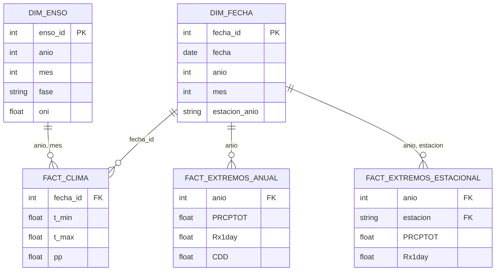

# Impacto del ENSO en los Índices de Precipitación y Temperatura Extrema en la Región de La Plata 🌊🌡️

## 🎯 Resumen del Proyecto
Este proyecto desarrolla una solución de Business Intelligence (BI) para analizar la influencia del fenómeno El Niño–Oscilación del Sur (ENSO) sobre los extremos climáticos en la ciudad de La Plata (1961-2024).

A través de la integración de fuentes de datos globales (NOAA) y locales (SMN), se construyó un ecosistema de datos que permite identificar patrones estacionales y anuales, facilitando la toma de decisiones en gestión del riesgo y planificación urbana.

## 🏗️ Ingeniería y Arquitectura de Datos

El núcleo técnico del proyecto es un Modelo Dimensional (Esquema de Constelación) que permite consultar datos con diferentes granularidades:

- Hechos (Facts): Registros diarios de clima y tablas de extremos climáticos (ETCCDI) calculados a nivel anual y estacional.
- Dimensiones (Dims): Dimensión de Tiempo jerárquica y Dimensión ENSO (con fases Niño, Niña y Neutro e intensidades).

## 🛠️ Stack Tecnológico
- **Procesamiento ETL:** `Python` (`Pandas`, `NumPy`)
- **Motor de Datos:** `DuckDB`
- **Dashboard**: `Streamlit` (Desplegado en Streamlit Cloud).
- **Librerías clave**: `pandas`, `scipy` (análisis estadístico), `statsmodels`.
- **Metodología:** Estándares internacionales **ETCCDI** para detección de cambio climático.

## 📂 Estructura del repositorio

- `app.py`: Punto de entrada del Dashboard interactivo.
- 📁 `pages/`: Módulos del dashboard (Panorama Climático, Análisis ENSO, etc.).
- 📁 `data/`: Datos crudos y curados (en formato CSV).
- 📁 `db/`: Lógica de conexión y persistencia con DuckDB.
- 📁 `notebooks/`: Análisis exploratorios y ETL.
- 📁 `model/`: Implementación del modelo dimensional
- 📁 `queries/`: Queries al modelo dimensional para el dashboard

## 🚀 Ejecución Local

1. **Clonar el repo:** `git clone https://github.com/tu-usuario/bi-clima-la-plata-enso.git`
2. **Instalar dependencias:** `pip install -r requirements.txt`
3. **Procesamiento de Datos (ETL):** 
    - Revisar `notebooks/eda-temp-pp.ipynb` para la imputación de datos meteorológicos.
    - Revisar `notebooks/eda-indices-enso.ipynb` para la imputación de tabla de indices.
    - Revisar `notebooks/calculo-indices-extremos.ipynb` para el cálculo de índices ETCCDI.
4. **Construir el Data Warehouse:** `python -m model.build_model` (Esto genera la base de datos DuckDB y carga el modelo dimensional).
5. **Lanzar el Dashboard:** `streamlit run app.py`

## Posibles trabajos a futuro
Este proyecto sienta las bases para una plataforma de monitoreo climático robusta. Las líneas de expansión incluyen:

- **Ingesta en Tiempo Real:** Automatizar la conexión con la API del SMN para actualizar el modelo dimensional diariamente sin intervención manual.
- **Modelos Predictivos:** Integrar modelos de Machine Learning para intentar predecir la probabilidad de eventos extremos basados en proyecciones del ONI/MEI.
- **Expansión Geográfica:** Replicar la arquitectura para otras estaciones meteorológicas de la Provincia de Buenos Aires para un análisis comparativo regional.
- **Exportación de Reportes:** Implementar la generación automática de reportes en PDF con los insights detectados durante cada estación del año.

---

**Autores**: [Franco Leando Kumichel](https://github.com/francokumichel), [Juan Francisco Volpe Giangiordano](https://github.com/JJuanVolpe)

**Institución**: Facultad de Informática - Universidad Nacional de La Plata (UNLP)

**Materia**: Tecnologías Aplicadas al Business Intelligence (TABI)
